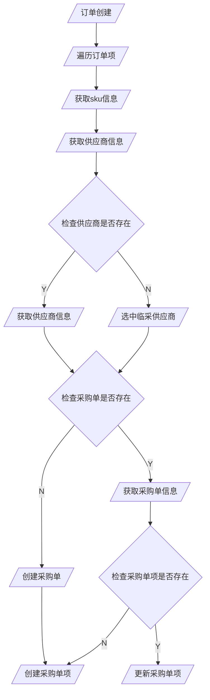

# 采购设计

表结构不需要写在这里

## 订单同步采购项

订单的修改需要同步采购项

采购单分为两种，
1. 根据订单自动聚合的采购单（每天每个供应商只会存在一个）
2. 用户手动创建的聚合采购单（每天每个供应商会存在多个）

- 对于情形1，订单数据存储在`purchase_order`表中，采购单项存储在`purchase_order_line`表中，采购单类型枚举值为1
- 对于情形2，订单数据存储在`manual_purchase_order`表中，采购单项存储在`purchase_order_line`表中，采购单类型枚举值为2
- 对于`purchase_order`，对`supplier_id`和`planning_id`建立联合索引
